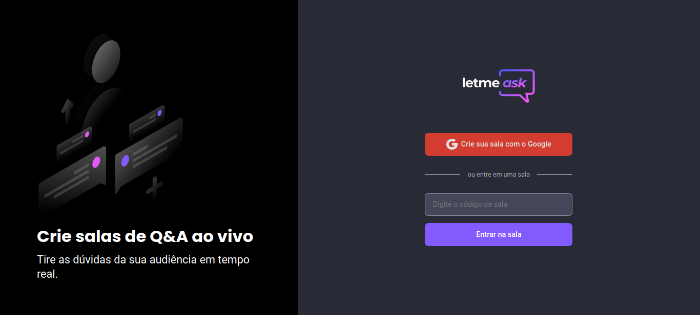

<p align="center">
  
</p>

<p align="center">
  
  
  

     
</p>

<h1 align="center">
  <a href="https://letmeask-2d300.web.app/">
    
  </a>
</h1>

<p align="center">
  <a href="#computer-projeto">Projeto</a>&nbsp; &nbsp; |&nbsp; &nbsp;
  <a href="#hammer_and_wrench-tecnologias">Tecnologias</a>&nbsp; &nbsp; |&nbsp; &nbsp;
  <a href="#rocket-como-executar">Como executar</a>&nbsp; &nbsp; |&nbsp; &nbsp;
  <a href="#computer-layout">Layout</a>&nbsp; &nbsp; |&nbsp; &nbsp;
  <a href="#memo-licença">Licença</a>&nbsp; &nbsp; |&nbsp; &nbsp;
</p>


<br>

## :computer:  Projeto

Letmeask é perfeito para criadores de conteúdos poderem criar salas de Q&A com o seu público, de uma forma muito organizada e democrática.

Este é um projeto desenvolvido durante a **[Next Level Week Together](https://nextlevelweek.com/)**, apresentada dos dias 20 a 27 de Junho de 2021.

## :hammer_and_wrench: Tecnologias

Esse projeto foi desenvolvido com as seguintes tecnologias:

- [ReactJS](https://reactjs.org/)
- [Typescript](https://www.typescriptlang.org/)
- [Firebase Auth](https://firebase.google.com/products/auth)
- [Firebase Realtime Database](https://firebase.google.com/products/realtime-database)
- [Saas](https://sass-lang.com/)
- [Chakra-Ui](https://chakra-ui.com/docs/getting-started)
- [Eslint](https://eslint.org/docs/user-guide/command-line-interface)
- [Prettier](https://prettier.io/)

## :rocket:  Como executar

Clone o projeto e acesse a pasta do mesmo.

```bash
$ git clone https://github.com/MarcusCastilho/letmeask.git
$ cd letmeask
```

Para iniciá-lo, siga os passos abaixo:

```bash
# Instalar as dependências
$ yarn

# Iniciar o projeto
$ yarn start
```

O app estará disponível no seu browser pelo endereço http://localhost:3000.

Lembrando que será necessário criar uma conta no [Firebase](https://firebase.google.com/) e um projeto para disponibilizar um Realtime Database.


## :computer: Layout

Você pode visualizar o layout do projeto através do link abaixo:

- [Layout Web](https://www.figma.com/file/u0BQK8rCf2KgzcukdRRCWh/Letmeask/duplicate)

Lembrando que você precisa ter uma conta no [Figma](http://figma.com/).

## :memo: Licença

Esse projeto está sob a licença MIT. Veja o arquivo [LICENSE](LICENSE.md) para mais detalhes.

---

Feito com 💜 by Rocketseat 👋🏻 [Participe da nossa comunidade](https://discord.gg/gKUVrzrPrU)
